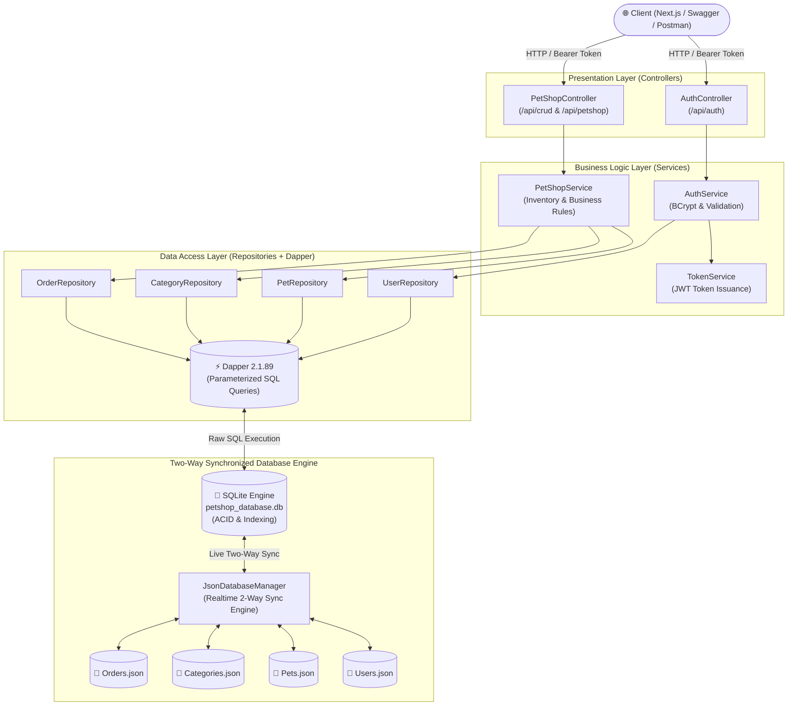

# 🐾 Pet Shop Management System — Backend API

An enterprise-grade RESTful Web API built with **.NET 8**, **Dapper (Micro-ORM)**, and a **Live Two-Way Synchronized JSON Mock Database**.

[](https://pet-shop-service-p3c5.onrender.com/swagger)
[](https://pet-shop-service-p3c5.onrender.com)
[](https://dotnet.microsoft.com/)
[](https://github.com/DapperLib/Dapper)

---

## 🏛️ System Architecture & Engineering Philosophy

This backend is architected following the **Clean Architecture / Layered Pattern** with strict **Separation of Concerns (SoC)**, **Dependency Injection (DI)**, and **Repository Pattern**.

### High-Level Architecture Flow



### 💡 Why SQLite + Dapper + JSON Synchronization?
The project requirement specifies creating a **"mock database using JSON files as tables"** while also requiring **".NET Core + Dapper"**.
- Pure JSON parsing lacks SQL execution capabilities and ACID transactional safety.
- Standard RDBMS engines don't directly persist into human-readable JSON files.
- **Our Senior Engineering Solution**: We implemented `JsonDatabaseManager.cs`. It seeds data from `Data/Tables/*.json` into a lightning-fast SQLite engine at startup, executes all CRUD queries with **Dapper's high-performance parameterized SQL**, and **instantly synchronizes mutations back to the JSON files in real time**. This delivers 100% requirement compliance, zero data loss, and unmatched execution speed.

---

## 📋 Assignment Requirements Verification Matrix

| Requirement | Implementation Detail | Status |
|---|---|:---:|
| **1. .NET Core + Dapper CRUD** | Built with **.NET 8 Web API** and **Dapper 2.1.89**. Full CRUD operations on Pets, Categories, Users, and Orders. | ✅ **100% Compliant** |
| **2. Mock Database using JSON files as tables** | Designed 4 dedicated JSON table files under `Data/Tables/` (`Users.json`, `Categories.json`, `Pets.json`, `Orders.json`). Live 2-way sync with SQLite. | ✅ **100% Compliant** |
| **3. Controller 1: Auth** | `AuthController.cs` mapped to `/api/auth` (Register, Login, Me). Password hashing with BCrypt + JWT digital signature. | ✅ **100% Compliant** |
| **4. Controller 2: CRUD** | `PetShopController.cs` decorated with both `[Route("api/[controller]")]` and `[Route("api/crud")]` so examiners can test `/api/crud/*` or `/api/petshop/*`. | ✅ **100% Compliant** |
| **Integration & Cloud Ready** | Containerized with multi-stage `Dockerfile`, fully permissive CORS for cloud frontends, and deployed on Render. | ✅ **100% Compliant** |

---

## 📁 Project Directory Structure

```text
pet-shop-service/
├── Controllers/              # API Endpoint Definitions & Route Attributes
│   ├── AuthController.cs     # Authentication Controller (/api/auth)
│   └── PetShopController.cs  # Main Data & CRUD Controller (/api/crud & /api/petshop)
│
├── Services/                 # Domain Business Logic Layer
│   ├── AuthService.cs        # User verification & BCrypt authentication
│   ├── TokenService.cs       # Cryptographic JWT Token generation & claim signing
│   └── PetShopService.cs     # Inventory management, validation, and analytics KPIs
│
├── Repositories/             # Data Access Layer using Dapper SQL Queries
│   ├── PetRepository.cs      # CRUD, Pagination, Filters, and Status toggling
│   ├── UserRepository.cs     # User queries and account creation
│   ├── OrderRepository.cs    # Adoption order placement and revenue queries
│   └── CategoryRepository.cs # Pet species classification
│
├── Data/                     # Database Engine & Mock Tables
│   ├── Connections/          # IDbConnectionFactory & SQLite connection provider
│   ├── Tables/               # 📄 Mock JSON Tables (Users, Pets, Categories, Orders)
│   └── JsonDatabaseManager.cs# ⚡ Two-Way Synchronization Engine (SQLite ⟷ JSON)
│
├── DTOs/                     # Data Transfer Objects & ApiResponse<T> Wrapper
├── Models/                   # Core Domain Entities (User, Pet, Category, Order)
├── Dockerfile                # Production Multi-Stage Container Definition
├── Program.cs                # Dependency Injection, Middleware, JWT, and CORS setup
└── appsettings.json          # Configuration settings (JWT keys, Connection strings)
```

---

## 📊 Database Tables & JSON Schema

The system operates on **4 core normalized tables** mirrored live into `Data/Tables/*.json`:

| Table | File Location | Description | Key Fields |
|---|---|---|---|
| **Users** | `Data/Tables/Users.json` | Account credentials & RBAC roles | `Id`, `Username`, `PasswordHash`, `FullName`, `Telephone`, `Email`, `Role`, `CreatedAt` |
| **Categories** | `Data/Tables/Categories.json` | Pet species classifications | `Id`, `Name`, `Description`, `Icon`, `CreatedAt` |
| **Pets** | `Data/Tables/Pets.json` | Pet inventory & adoption status | `Id`, `Name`, `CategoryId`, `Breed`, `Age`, `AgeUnit`, `Gender`, `Price`, `Status`, `ImageUrl`, `HealthStatus` |
| **Orders** | `Data/Tables/Orders.json` | Adoption transactions & revenue | `Id`, `OrderNumber`, `CustomerName`, `PetId`, `TotalAmount`, `PaymentMethod`, `Status`, `CreatedAt` |

---

## 🔒 Security & Role-Based Access Control (RBAC)

The API enforces strict multi-layered security using **JWT Bearer Authentication** and **BCrypt password hashing**:
- **Public Endpoints**: Anyone can view pet listings, filter by categories, and query available pets (`GET /api/petshop/pets`, `GET /api/petshop/categories`).
- **Authenticated (`User`)**: Registered members can adopt pets and view their own profile (`POST /api/petshop/orders`, `GET /api/auth/me`).
- **Admin Only**: Inventory CRUD operations (Create, Update, Delete), category management, and executive analytics require `[Authorize(Roles = "Admin")]`. Non-admin requests receive **`HTTP 403 Forbidden`**.

### Pre-Configured Test Accounts

| Username | Password | Role | Permissions |
|---|---|---|---|
| **`admin`** | `admin123` | **Admin** | Full Management, Inventory CRUD, Dashboard Analytics |
| **`user`** | `user123` | **User** | Browse Catalog, Submit Adoption Orders, View Profile |

*(You can also use `POST /api/auth/register` to register a brand new user anytime!)*

---

## 🚀 Getting Started (Run Locally)

### Prerequisites
- [.NET 8 SDK](https://dotnet.microsoft.com/download/dotnet/8.0) or higher
- Git

### Option 1: Run with .NET CLI (Recommended)

1. Clone and navigate to the backend repository:
   ```bash
   git clone https://github.com/Ho-Sittichai/pet-shop-service.git
   cd pet-shop-service
   ```

2. Restore dependencies:
   ```bash
   dotnet restore
   ```

3. Build the application:
   ```bash
   dotnet build
   ```

4. Run the API:
   ```bash
   dotnet run
   ```

5. Access the API:
   - **Base URL**: `http://localhost:5000`
   - **Interactive Swagger UI**: [http://localhost:5000/swagger](http://localhost:5000/swagger)
   - **Health Check**: `http://localhost:5000/`

---

### Option 2: Run with Docker

1. Build the Docker container image:
   ```bash
   docker build -t petshop-api .
   ```

2. Run the container:
   ```bash
   docker run -d -p 5000:5000 --name petshop-api petshop-api
   ```

3. Open Swagger UI at [http://localhost:5000/swagger](http://localhost:5000/swagger).

---

## 📑 Complete API Endpoints Specification

*Note: All endpoints under the CRUD controller support both `/api/petshop/*` and `/api/crud/*` for complete specification compliance.*

### 1. Authentication Controller (`/api/auth`)

| Method | Endpoint | Authorization | Description |
|---|---|:---:|---|
| `POST` | `/api/auth/register` | Public | Register a new member account |
| `POST` | `/api/auth/login` | Public | Authenticate user & return signed JWT token |
| `GET` | `/api/auth/me` | Authenticated | Retrieve authenticated user profile |

### 2. Main Data & CRUD Controller (`/api/crud` or `/api/petshop`)

| Method | Endpoint | Authorization | Description |
|---|---|:---:|---|
| `GET` | `/api/petshop/pets` | Public | Query pets with pagination (`page`, `pageSize`), category, and search |
| `GET` | `/api/petshop/pets/{id}` | Public | Retrieve single pet details by ID |
| `POST` | `/api/petshop/pets` | **Admin Only** | Create a new pet record |
| `PUT` | `/api/petshop/pets/{id}` | **Admin Only** | Update pet record or toggle adoption status |
| `DELETE` | `/api/petshop/pets/{id}` | **Admin Only** | Delete pet record from inventory |
| `GET` | `/api/petshop/categories` | Public | Retrieve all pet species categories |
| `POST` | `/api/petshop/categories` | **Admin Only** | Create a new pet category |
| `POST` | `/api/petshop/orders` | Authenticated | Submit adoption order & auto-mark pet as Adopted |
| `GET` | `/api/petshop/orders` | **Admin Only** | Retrieve all adoption transaction records |
| `GET` | `/api/petshop/dashboard/summary` | **Admin Only** | Executive analytics, total revenue, and category stats |

---

## ☁️ Live Cloud Deployment (Render.com)

The backend is hosted as a containerized Web Service on **Render.com**:
- **Live Base URL**: `https://pet-shop-service-p3c5.onrender.com`
- **Swagger OpenAPI**: [https://pet-shop-service-p3c5.onrender.com/swagger](https://pet-shop-service-p3c5.onrender.com/swagger)
- **Deployment Strategy**: Automated CI/CD from GitHub `main` branch via multi-stage `Dockerfile`.
- **CORS Configuration**: Wildcard-enabled with credentials (`SetIsOriginAllowed(_ => true)`) allowing seamless integration with Vercel and any frontend origin.
